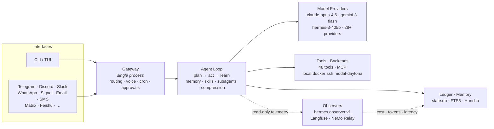

# ☤ Hermes Agent — Configuration Overview

> My self-improving agent: one gateway, every messaging platform, a closed
> learning loop, and full-fidelity cost & trace observability across a fleet of
> models. Built on **[NousResearch/hermes-agent](https://github.com/NousResearch/hermes-agent)** (MIT).

| | |
|---|---|
| **Model providers** | 28+ |
| **Messaging platforms** | 17+ |
| **Core tools** | 48 |
| **Skill domains** | 17 |
| **Terminal backends** | 6 |
| **Observers** | 2 (Langfuse, NeMo Relay) |

> 📊 **A polished, interactive version of this page** (with rendered charts and
> the live spend table) is in [`index.html`](./index.html). Run
> `python generate.py --inject` to bake in your real telemetry, then open
> `hermes-overview.html`.

---

## System map

Every interface flows through one gateway into the agent loop. The loop calls
models through a provider abstraction, runs tools across pluggable backends, and
emits a **read-only** telemetry stream to the observers — without changing
runtime behavior.



The observer contract reports *what happened*; it never replaces a provider
request, tool argument, or execution callback.

---

## Systems

| System | What it does |
|---|---|
| 🛰️ **Messaging Gateway** | One process fans out to every chat surface — Telegram, Discord, Slack, WhatsApp, Signal, Email, SMS, Matrix, Feishu and more. Voice-memo transcription, cross-platform conversation continuity, per-platform approval UX. |
| 🧠 **Closed Learning Loop** | Agent-curated memory with periodic nudges, autonomous skill creation after complex tasks, skills that self-improve during use, FTS5 session search for cross-session recall, and [Honcho](https://github.com/plastic-labs/honcho) dialectic user modeling. |
| 🧰 **Tools & Toolsets** | 48 core tools (web, terminal, files, browser automation, vision, image/video generation, code execution, messaging) grouped into composable toolsets — plus any MCP server. |
| 📚 **Skills** | Procedural memory across 17 domains, compatible with the [agentskills.io](https://agentskills.io) open standard, self-authoring after complex work. |
| ⏰ **Cron Automations** | Built-in scheduler delivering to any platform — daily reports, nightly backups, weekly audits — in natural language, running unattended. |
| 🖥️ **Terminal Backends** | Six execution targets. Daytona & Modal hibernate when idle and wake on demand — the environment costs nearly nothing between sessions. |
| 🧬 **Subagents** | Isolated subagents for parallel workstreams; Python that calls tools over RPC, collapsing pipelines into zero-context-cost turns. |
| 🔭 **Observability** | Backend-neutral observer contract (`hermes.observer.v1`) emitting trace, cost, token, and latency telemetry to Langfuse and NeMo Relay. Fail-open — never blocks the agent. |
| 🔌 **Providers & MCP** | 28+ model providers behind one switch (`hermes model`), plus pluggable MCP servers (Linear, n8n, computer-use, …). |

---

## Models — which model does which job

Hermes runs a small fleet: a flagship for reasoning, a cheap fast model for the
high-volume auxiliary work, and a local model for voice. These are the
configured defaults — swap any with `hermes model`, no code changes.

| Function | Config key | Model | Provider |
|---|---|---|---|
| 🟡 **main agent** | `model.default` | `anthropic/claude-opus-4.6` | Anthropic |
| 🟣 **subagent** | `delegation.model` | `google/gemini-3-flash-preview` | Google / OpenRouter |
| 🔵 **compression** | `compression.summary_model` | `google/gemini-3-flash-preview` | Google / OpenRouter |
| 🌸 **vision / aux** | `default_aux_model` | `gemini-3.5-flash` · `claude-haiku-4-5-20251001` | Gemini · Anthropic |
| 🟢 **title-gen** | `default_aux_model` | `claude-haiku-4-5-20251001` | Anthropic |
| 🟠 **transcription** | `stt.model` | `whisper-1` (local faster-whisper / Groq) | OpenAI · local |
| 🔴 **session search** | `default_aux_model` | `google/gemini-3-flash-preview` | Google / OpenRouter |

Auxiliary tasks fall back to each provider's `default_aux_model` when the main
model isn't ideal. Nous fallback family: `hermes-3-405b`, `hermes-3-70b`.

---

## Providers — the model fleet (28+, one switch)

| Provider | Endpoint | Representative models | Source |
|---|---|---|---|
| Nous Portal / Research | `inference.nousresearch.com` | `hermes-3-405b`, `hermes-3-70b` | [portal](https://portal.nousresearch.com) |
| OpenRouter | `openrouter.ai/api/v1` | 200+ routed (Claude, GPT, Gemini, DeepSeek) | [openrouter.ai](https://openrouter.ai) |
| Anthropic | `api.anthropic.com` | `claude-opus-4.6`, `claude-haiku-4-5` | [anthropic](https://www.anthropic.com) |
| Google Gemini | `generativelanguage.googleapis.com` | `gemini-3-flash`, `gemini-3.5-flash` | [ai studio](https://aistudio.google.com) |
| NovitaAI | `api.novita.ai/openai/v1` | `deepseek-v3-0324`, `qwen3-235b` | [novita.ai](https://novita.ai) |
| NVIDIA NIM | `integrate.api.nvidia.com` | `llama-3.3-70b`, Nemotron | [build.nvidia](https://build.nvidia.com) |
| DeepSeek | `api.deepseek.com/v1` | `deepseek-chat`, `deepseek-reasoner` | [deepseek](https://platform.deepseek.com) |
| z.ai (GLM) | `api.z.ai/api/paas/v4` | GLM family | [z.ai](https://z.ai) |
| Kimi / Moonshot | `api.moonshot.ai/v1` | Kimi K2 family | [moonshot](https://platform.moonshot.ai) |
| MiniMax | `api.minimax.io/anthropic` | MiniMax-M family | [minimax](https://www.minimax.io) |
| Xiaomi MiMo | `api.xiaomimimo.com/v1` | MiMo family | [xiaomi](https://platform.xiaomimimo.com) |
| Hugging Face | Inference Providers | 20+ open models | [huggingface](https://huggingface.co) |
| AWS Bedrock | `bedrock_converse` | Claude on Bedrock | [bedrock](https://aws.amazon.com/bedrock/) |
| OpenAI Codex · xAI · Azure · Ollama Cloud · … | various | + 14 more provider plugins | [plugins/](https://github.com/NousResearch/hermes-agent/tree/main/plugins/model-providers) |

---

## Spend — daily, by function & model

The per-session cost ledger lives in `~/.hermes/state.db`, with
provider-confirmed actuals where available and pinned official-pricing estimates
otherwise (`cost_status` ∈ `actual` / `estimated` / `included` / `unknown`). The
fine function split (compression, titles, vision, transcription) is folded in
from the observer's per-request trace.

> **This table is wired but unpopulated here** — it fills with your real numbers
> the moment you run the generator. No figures are invented.

```
$ cd config-overview
$ python generate.py --days 30 --atof ~/.hermes/relay --inject
```

| Day | Function | Model | Input | Output | Cost |
|---|---|---|---:|---:|---:|
| _YYYY-MM-DD_ | `main` | `anthropic/claude-opus-4.6` | — | — | — |
| _YYYY-MM-DD_ | `subagent` | `google/gemini-3-flash-preview` | — | — | — |
| _YYYY-MM-DD_ | `compression` | `google/gemini-3-flash-preview` | — | — | — |
| _YYYY-MM-DD_ | `vision` | `gemini-3.5-flash` | — | — | — |
| _YYYY-MM-DD_ | `transcription` | `whisper-1` | — | — | — |

**The query behind the table** (`main` vs `subagent` split directly from the
ledger; the finer functions come from the observer export):

```sql
SELECT date(started_at,'unixepoch','localtime') AS day,
       CASE WHEN parent_session_id IS NULL THEN 'main' ELSE 'subagent' END AS function,
       model,
       SUM(COALESCE(actual_cost_usd, estimated_cost_usd, 0)) AS cost_usd,
       SUM(input_tokens)  AS input_tokens,
       SUM(output_tokens) AS output_tokens
FROM sessions
WHERE started_at >= :since AND archived = 0
GROUP BY day, function, model
ORDER BY day DESC, cost_usd DESC;
```

You can also read the same numbers live in Hermes itself:

```
/usage                # current session token + cost breakdown
/insights --days 30   # model / platform / tool / skill / activity report
```

---

## Observer — what the telemetry stream emits

Every API request and tool call emits a sanitized, timed, correlated event on
the `hermes.observer.v1` contract. The charts in [`index.html`](./index.html)
render straight from this stream.

**Per-request payload** (`post_api_request` / `post_llm_call`):

| Field | Meaning |
|---|---|
| `model`, `provider`, `api_mode`, `base_url` | Which model answered, and how it was routed |
| `usage.input` / `output` | Prompt and completion tokens |
| `usage.cache_read_input_tokens` / `cache_creation_input_tokens` | Prompt-cache hits / writes |
| `usage.reasoning_tokens` | Thinking tokens |
| `cost_details` | Per-type USD breakdown (input / output / cache) |
| `api_duration` | Latency, seconds |
| `finish_reason` | `end_turn`, `tool_use`, … |
| `turn_type` | Function attribution (main / subagent / compression / …) |

**Correlation IDs** join events without relying on order: `session_id`,
`task_id`, `turn_id`, `api_request_id`, `tool_call_id`, plus
`parent_session_id` / `child_session_id` for delegated subagents.

**Backends**

| Observer | Enable | Exports |
|---|---|---|
| **Langfuse** | `hermes plugins enable observability/langfuse` | Hosted traces, LLM/tool spans, cost & token dashboards |
| **NeMo Relay** | `hermes plugins enable observability/nemo_relay` | ATOF JSONL + ATIF JSON trajectory exports (feeds the fine function split) |

Both fail open: without credentials the hooks no-op silently and the agent loop
keeps running.

---

## Sources — every repo & project this is built on

**Core**
- [NousResearch/hermes-agent](https://github.com/NousResearch/hermes-agent) — the agent
- [Documentation](https://hermes-agent.nousresearch.com/docs/)
- [Nous Research](https://nousresearch.com)

**Memory & Skills**
- [plastic-labs/honcho](https://github.com/plastic-labs/honcho) — dialectic user modeling
- [agentskills.io](https://agentskills.io) — open skills standard

**Observability**
- [langfuse/langfuse](https://github.com/langfuse/langfuse) · [cloud.langfuse.com](https://cloud.langfuse.com)
- [NVIDIA/NeMo](https://github.com/NVIDIA/NeMo)

**Community bridges**
- [avifenesh/computer-use-linux](https://github.com/avifenesh/computer-use-linux) — Linux desktop-control MCP
- [AaronWong1999/hermesclaw](https://github.com/AaronWong1999/hermesclaw) — WeChat bridge

**Providers**
- [Nous Portal](https://portal.nousresearch.com) · [OpenRouter](https://openrouter.ai) ·
  [NovitaAI](https://novita.ai) · [NVIDIA](https://build.nvidia.com) ·
  [z.ai](https://z.ai) · [Moonshot](https://platform.moonshot.ai) ·
  [MiniMax](https://www.minimax.io) · [Hugging Face](https://huggingface.co) ·
  [DeepSeek](https://platform.deepseek.com)

**Community**
- [Discord](https://discord.gg/NousResearch) · [Issues](https://github.com/NousResearch/hermes-agent/issues)

---

<sub>☤ Built by Nous Research, configured by me. Model names and defaults are
verified against the repo's provider plugins and config examples; spend figures
come from your own `~/.hermes/state.db`.</sub>
